# Genuary 2025

[Genuary 2025](https://genuary.art)

## 🌄 Gallery

<!-- IMAGE-LIST:START - Do not remove or modify this section -->
<!-- prettier-ignore-start -->
<!-- markdownlint-disable -->
<table>
  <tbody>
    <tr>
      <td align="center"><a href="https://github.com/kfahn22/Genuary-2025/tree/main/1-vertical-horizonatal-lines"> 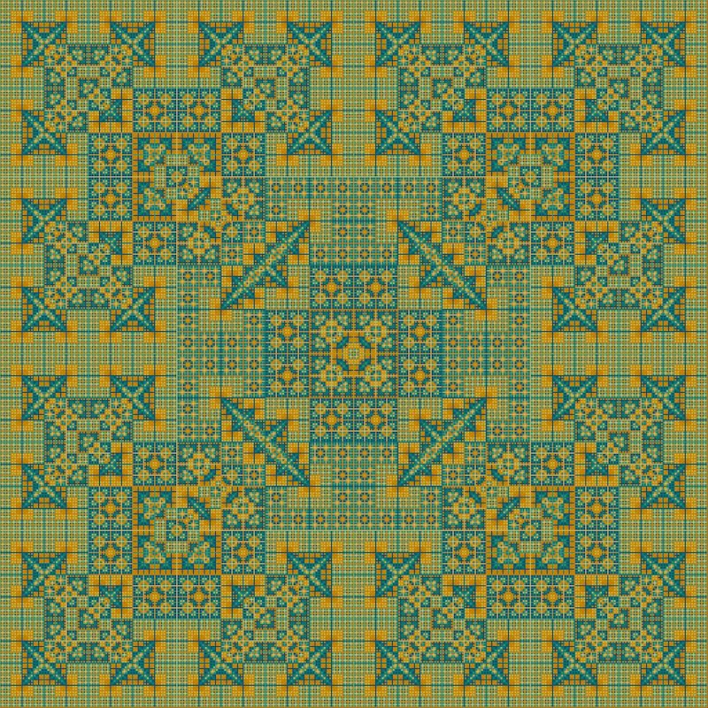 <b>January 1 Vertical and Horizonatal Lines Only</b></a></td>
      <td align="center"><a href="https://github.com/kfahn22/Genuary-2025/tree/main/2-layers-upon-layers"> 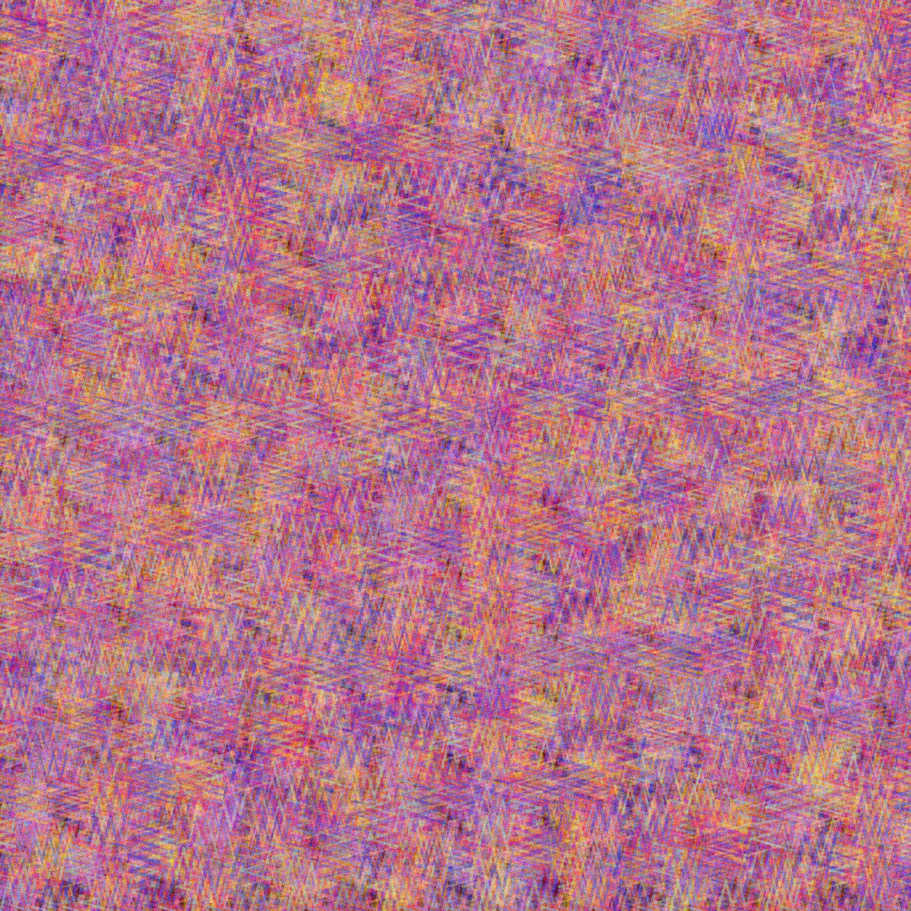 <b>January 2 Layers upon layers upon layers</b></a></td>
     <td align="center"><a href="https://github.com/kfahn22/Genuary-2025/tree/main/3-exactly-42-lines"> 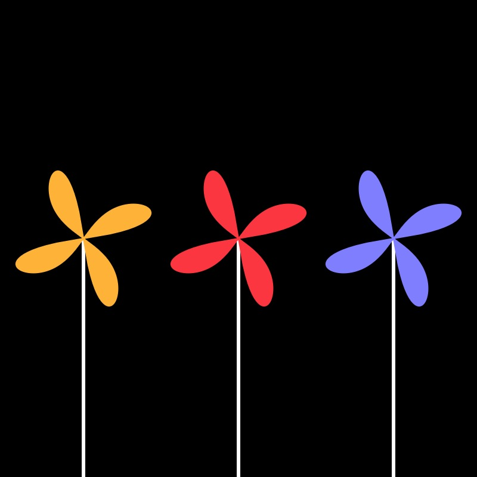 <b>January 3 Exactly 42 lines of code</b></a></td>
     <td align="center"><a href="https://github.com/kfahn22/Genuary-2025/tree/main/4-black-upon-black"> 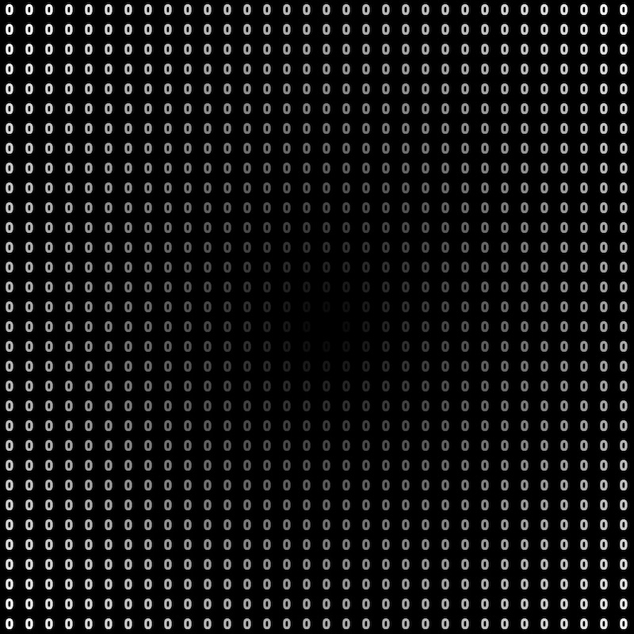 <b>January 4 Black Upon Black</b></a></td>
    </tr>
    <tr>
      <td align="center"><a href="https://github.com/kfahn22/Genuary-2025/tree/main/5-isometric-art"> 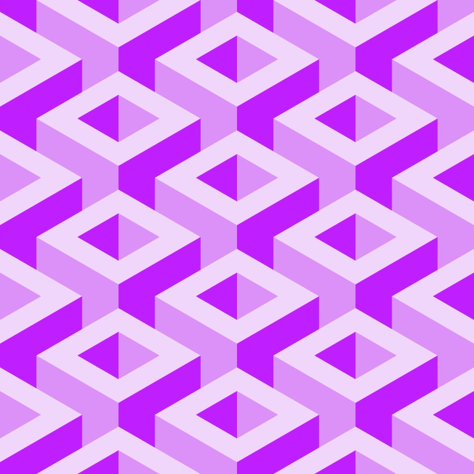 <b>January 5 Isometric Art (No vanishing points).</b></a></td>
      <td align="center"><a href="https://github.com/kfahn22/Genuary-2025/tree/main/6-landscape-with-primitive-shapes"> 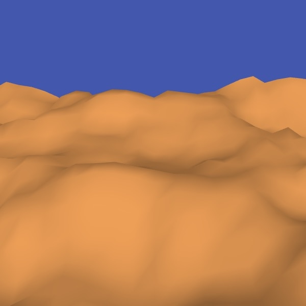 <b>January 6 Landscape with primitive Shapes</b></a></td>
      <td align="center"><a href="https://github.com/kfahn22/Genuary-2025/blob/main/7-use-software-not-intended-for-generative-art/ten_print.py"> 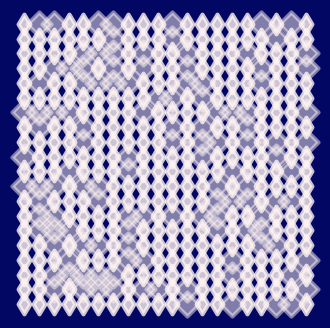 <b>January 7 Use software that is not intended to create art or images.</b></a></td>
      <td align="center"><a href="https://github.com/kfahn22/Genuary-2025/tree/main/8-draw-one-million-of-something"> 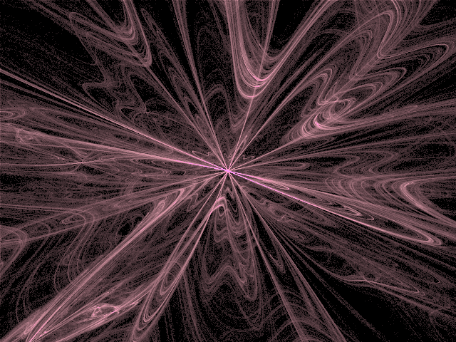 <b>January 8 Draw one million of something</b></a></td>
    </tr>
    <tr>
      <td align="center"><a href="https://github.com/kfahn22/Genuary-2025/tree/main/9-the-textile-design-patterns-of-public-transport-seating."> 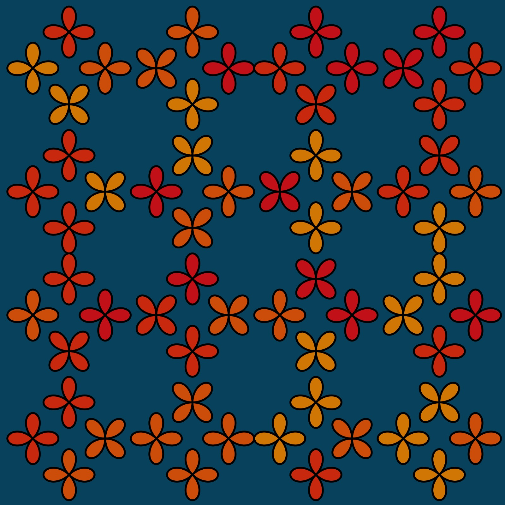 <b>January 9 The textile design patterns of public transport seating</b></a></td>
       <td align="center"><a href="https://github.com/kfahn22/Genuary-2025/tree/main/10-tau"> 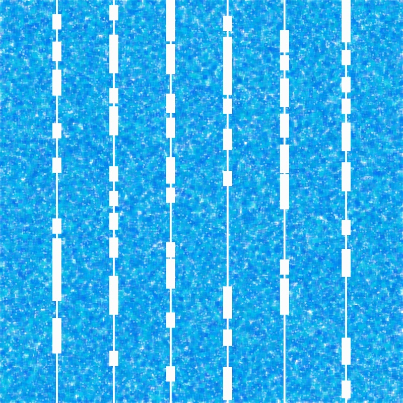 <b>January 10 You can only use TAU in your code, no other number allowed.</b></a></td>
      <td align="center"><a href="https://github.com/kfahn22/Genuary-2025/tree/main/11-impossible"> 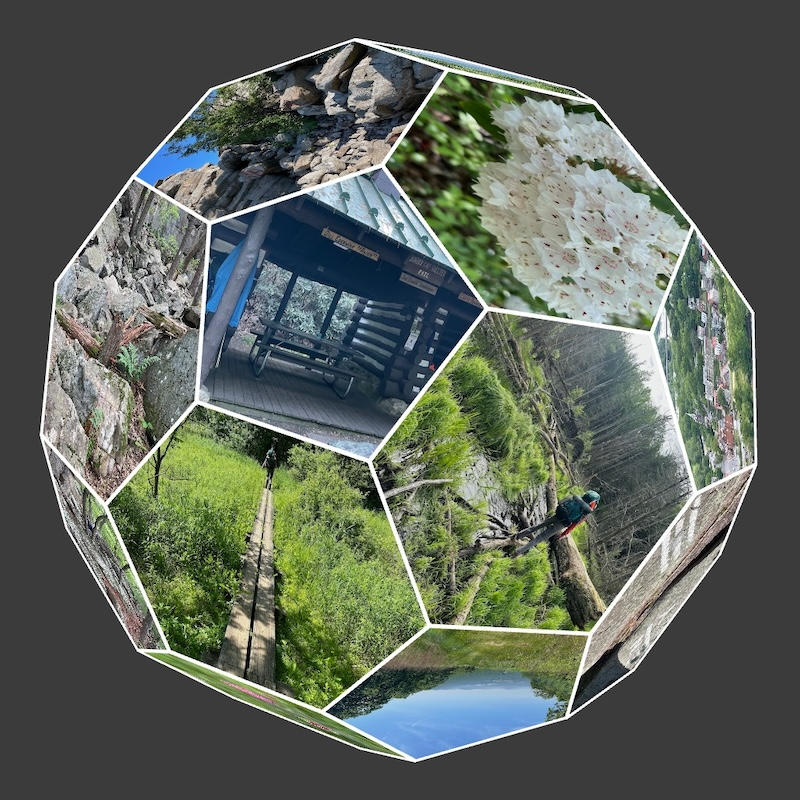 <b>January 11 Impossible day </b></a></td>
    </tr>
   
   
   </tbody>
</table>

<!-- markdownlint-restore -->
<!-- prettier-ignore-end -->

<!-- IMAGE-LIST:END -->

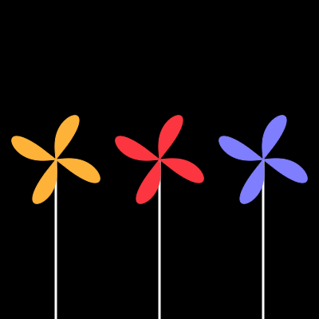

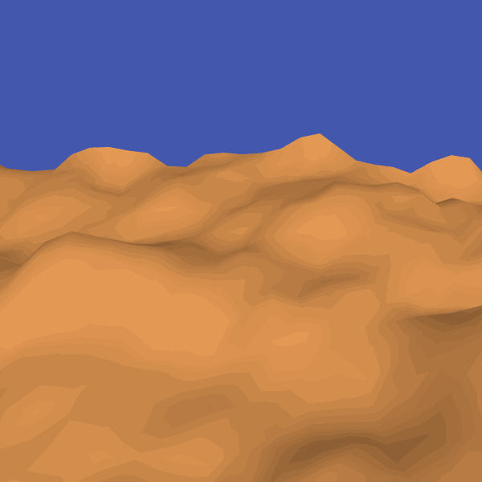

