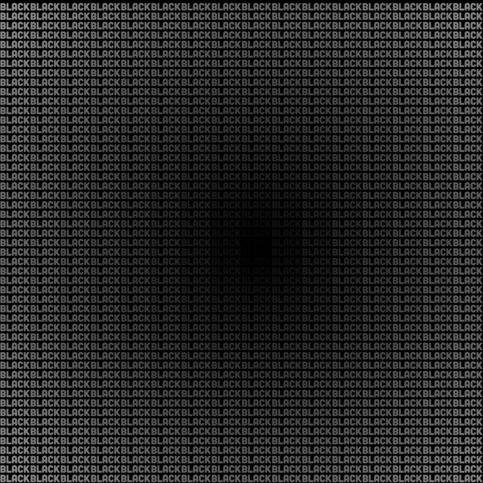
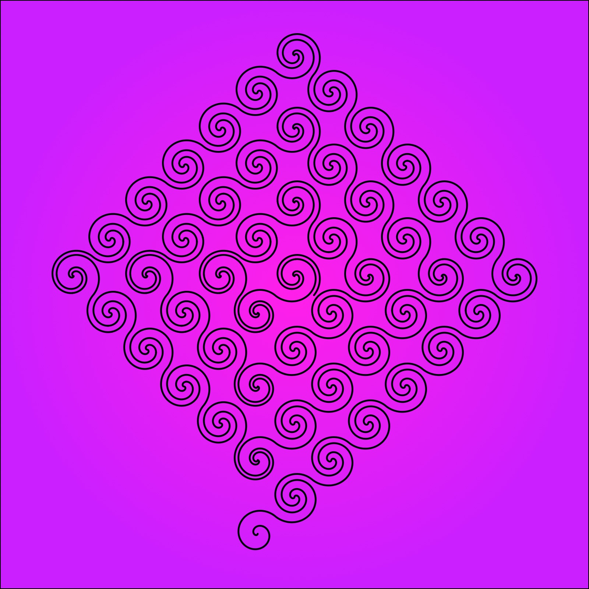
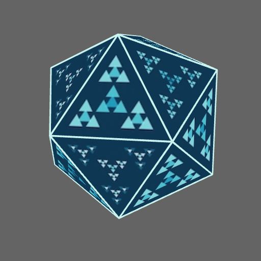
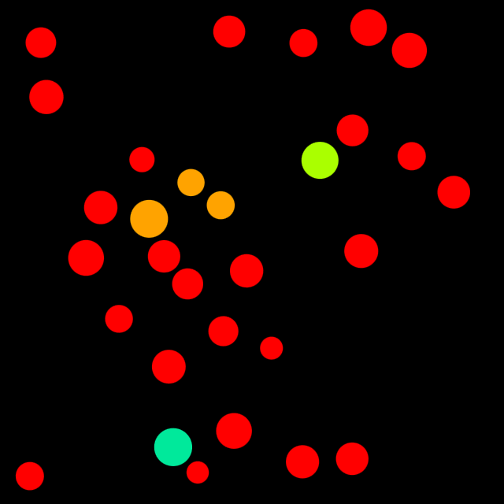

# Genuary 2025

[Genuary 2025](https://genuary.art)

## 🌄 Gallery

<!-- IMAGE-LIST:START - Do not remove or modify this section -->
<!-- prettier-ignore-start -->
<!-- markdownlint-disable -->
<table>
  <tbody>
    <tr>
      <td align="center"><a href="https://github.com/kfahn22/Genuary-2025/tree/main/1-vertical-horizonatal-lines">  <b>January 1 Vertical and Horizonatal Lines Only</b></a></td>
      <td align="center"><a href="https://github.com/kfahn22/Genuary-2025/tree/main/2-layers-upon-layers">  <b>January 2 Layers upon layers upon layers</b></a></td>
     <td align="center"><a href="https://github.com/kfahn22/Genuary-2025/tree/main/3-exactly-42-lines">  <b>January 3 Exactly 42 lines of code</b></a></td>
     <td align="center"><a href="https://github.com/kfahn22/Genuary-2025/tree/main/4-black-upon-black">  <b>January 4 Black Upon Black</b></a></td>
    </tr>
    <tr>
      <td align="center"><a href="https://github.com/kfahn22/Genuary-2025/tree/main/5-isometric-art">  <b>January 5 Isometric Art (No vanishing points).</b></a></td>
      <td align="center"><a href="https://github.com/kfahn22/Genuary-2025/tree/main/6-landscape-with-primitive-shapes">  <b>January 6 Landscape with primitive Shapes</b></a></td>
      <td align="center"><a href="https://github.com/kfahn22/Genuary-2025/blob/main/7-use-software-not-intended-for-generative-art/ten_print.py">  <b>January 7 Use software that is not intended to create art or images.</b></a></td>
      <td align="center"><a href="https://github.com/kfahn22/Genuary-2025/tree/main/8-draw-one-million-of-something">  <b>January 8 Draw one million of something</b></a></td>
    </tr>
    <tr>
      <td align="center"><a href="https://github.com/kfahn22/Genuary-2025/tree/main/9-the-textile-design-patterns-of-public-transport-seating.">  <b>January 9 The textile design patterns of public transport seating</b></a></td>
       <td align="center"><a href="https://github.com/kfahn22/Genuary-2025/tree/main/10-tau">  <b>January 10 You can only use TAU in your code, no other number allowed.</b></a></td>
      <td align="center"><a href="https://github.com/kfahn22/Genuary-2025/tree/main/11-impossible">  <b>January 11 Impossible day </b></a></td>
       <td align="center"><a href="https://github.com/kfahn22/Genuary-2025/tree/main/12-subdivision">  <b>January 12 Subdivision</b></a></td>
    </tr>
    <tr>
      <td align="center"><a href="https://github.com/kfahn22/Genuary-2025/tree/main/13-triangles-and-nothing-else">  <b>January 13 Triangles and Nothing else</b></a></td>
      <td align="center"><a href="https://github.com/kfahn22/Genuary-2025/tree/main/14-pure-black-and-white-no-gray">  <b>January 14 Black and White. No Gray</b></a></td>
       <td align="center"><a href="https://github.com/kfahn22/Genuary-2025/tree/main/15-design-a-rug">  <b>January 15 Design a rug</b></a></td>
       <td align="center"><a href="https://github.com/kfahn22/Genuary-2025/tree/main/16-generative-palette">  <b>January 16 Generative Palette</b></a></td>
    </tr>
    <tr>
     <td align="center"><a href="https://github.com/kfahn22/Genuary-2025/tree/main/17-what-happens-if-pi-is-4">  <b>January 17 What happens if pi is 4</b></a></td>
      <td align="center"><a href="https://github.com/kfahn22/Genuary-2025/tree/main/18-what-does-wind-look-like?">  <b>January 18 What does wind look like?</b></a></td>
        <td align="center"><a href="https://github.com/kfahn22/Genuary-2025/tree/main/19-Op-Art">  <b>January 19 Op Art</b></a></td>
           <td align="center"><a href="https://github.com/kfahn22/Genuary-2025/tree/main/20-generative-architecture">  <b>January 20 Generative Architecture</b></a></td>
    </tr>
    <tr>
   <td align="center"><a href="https://github.com/kfahn22/Genuary-2025/tree/main/21-create-a-collision-system">  <b>January 21 Create a collision detection system (no libraries allowed)</b></a>
    </td>
       <td align="center"><a href="https://github.com/kfahn22/Genuary-2025/tree/main/22-gradients-only">  <b>January 22 Gradients Only</b></a>
    </td>
    </td>
       <td align="center"><a href="https://github.com/kfahn22/Genuary-2025/tree/main/23-Inspired-by-brutalism">  <b>January 23 Inspired by brutalism.</b></a>
    </td>
    </td>
    </td>
       <td align="center"><a href="https://github.com/kfahn22/Genuary-2025/tree/main/24-Geometric-art/L-system-Playground">  <b>January 24 Geometric art - pick either a circle, rectangle, or triangle and use only that geometric shape.</b></a>
    </td>
    </tr>
    <tr>
     </td>
       <td align="center"><a href="https://github.com/kfahn22/Genuary-2025/tree/main/25-one-line">  <b>January 25 One line that may or may not intersect itself</b></a>
    </td>
    </tr>
   
   
   
   </tbody>
</table>

<!-- markdownlint-restore -->
<!-- prettier-ignore-end -->

<!-- IMAGE-LIST:END -->

## GIFS

